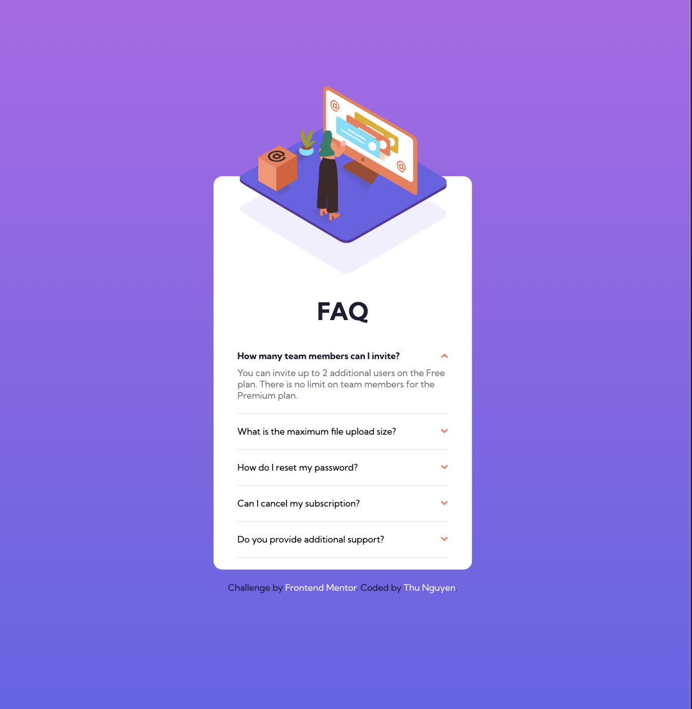
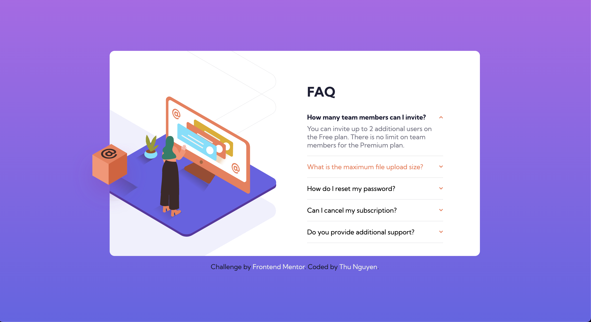

# Frontend Mentor - FAQ accordion card solution

This is a solution to the [FAQ accordion card challenge on Frontend Mentor](https://www.frontendmentor.io/challenges/faq-accordion-card-XlyjD0Oam). Frontend Mentor challenges help you improve your coding skills by building realistic projects. 

## Table of contents

- [Overview](#overview)
  - [The challenge](#the-challenge)
  - [Screenshot](#screenshot)
  - [Links](#links)
- [My process](#my-process)
  - [Built with](#built-with)
  - [What I learned](#what-i-learned)
- [Author](#author)
- [Feedback](#acknowledgments)

## Overview

### The challenge

Users should be able to:

- View the optimal layout for the component depending on their device's screen size
- See hover states for all interactive elements on the page
- Hide/Show the answer to a question when the question is clicked

### Screenshot




### Links

- Solution URL: [GitHub](https://github.com/NgocMinhThuNguyen/FAQ-accordion-card)
- Live Site URL: [Live Site](https://your-live-site-url.com)

## My process

### Built with

- Semantic HTML5 markup
- CSS custom properties
- Flexbox
- CSS Grid
- Javascript
- Mobile-first workflow

### What I learned

This is a very intering project, I learned a lot when doing this practice

First of all, I learned HTML tag to change to image with different device's width

```html
<picture>
      <source srcset="images/illustration-woman-online-mobile.svg" media="(max-width: 1023px)">
      <source srcset="images/illustration-box-desktop.svg" media="(min-width: 1023px)">
      
</picture>
```

Secondly, I also learned that there are two ways to do the FAQ, using `<dl>` tag or `<details>` tag

## Author

- Website - [Thu Nguyen](https://github.com/NgocMinhThuNguyen)
- Frontend Mentor - [@NgocMinhThuNguyen](https://www.frontendmentor.io/profile/NgocMinhThuNguyen)

## Feedback

Hi there!

I'd be happy if you can give some feedback on my work!

Have a nice day!

Thank you!
